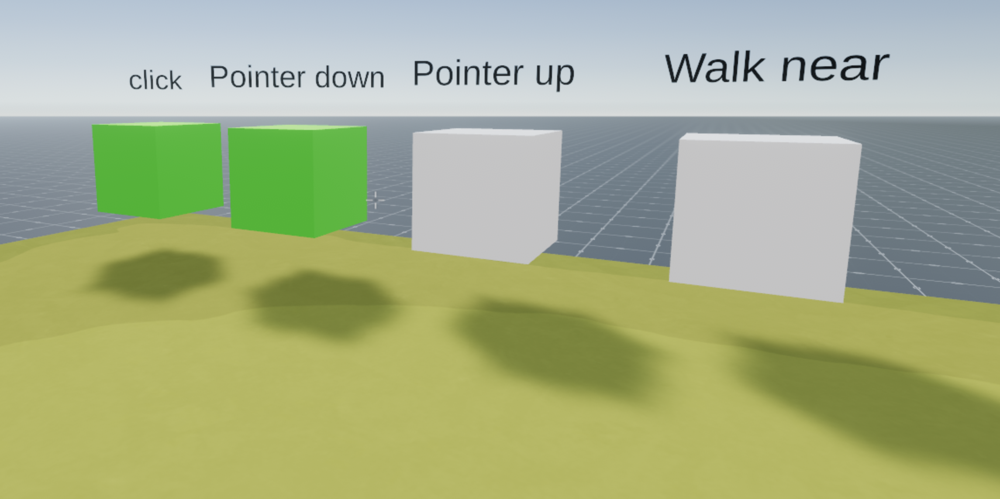

# Basic interactions

A scene with examples of some simple interactions. Perform the corresponding action on each cube to turn it green.

<!--
[Explore the scene](https://blockdog-flbnuykvwf.now.sh): this link takes you to a copy of the scene deployed to a remote server where you can interact with it just as if you were running `dcl start` locally.
-->



**Install the CLI**

Download and install the Decentraland CLI by running the following command

```bash
npm i -g decentraland
```

For a more details, follow the steps in the [Installation guide](https://docs.decentraland.org/documentation/installation-guide/).

**Previewing the scene**

Once you've installed the CLI, download this example and navigate to its directory from your terminal or command prompt.

_from the scene directory:_

```
$:  dcl start
```

Any dependencies are installed and then the CLI will open the scene in a new browser tab automatically.

**Usage**

Follow the labels on each cube to turn it green, testing all the different ways a player can interact with a Decentraland scene.

Learn more about how to build your own scenes in our [documentation](https://docs.decentraland.org/) site.


If something doesn’t work, please [file an issue](https://github.com/decentraland-scenes/Awesome-Repository/issues/new).

## Copyright info

This scene is protected with a standard Apache 2 licence. See the terms and conditions in the [LICENSE](/LICENSE) file.
